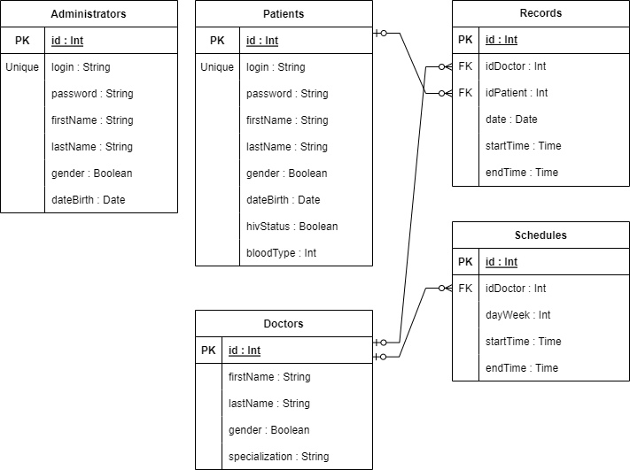

# Web-разработка

## Лабораторная работа №1
1. Цель работы.
  
Данное приложение позволит автоматизировать запись пациентов к врачам.
  
2. Краткий перечень функциональных требований.
  
Незарегитсрированный пользователь сможет посмотреть список врачей и войти в систему или зарегистрироваться. \
Пациент также сможет записаться к врачу и редактировать свои записи и свой аккаунт. \
Администратор сможет редактировать все записи, аккаунты и всех врачей в системе.
  
3. Use-case диаграмма системы:
  

  
4. BPMN диаграммы основных бизнес-процессов.
  
BPMN диаграммы для адимнимстратора.\
Работа с записью на приём:\
\
Работа со списком врачей:\
\
Работа с данными аккаунтов:\
\
BPMN диаграммы для пользователя.\
Работа со своей записью на приём:\
\
Изменение данных своего аккаунта:\

  
5. Примеры описания основных пользовательских сценариев.
  
Незарегистрированный пользователь может войти в систему, зарегистрироваться и посмотреть список врачей.\
Администратор может посмотреть список врачей, изменить данные своего аккаунта и добавить, удалить или изменить врача, пользователя или запись на приём.\
Пользователь может посмотреть список врачей, изменить данные своего аккаунта и добавить, удалить или изменить запись на приём.
  
6. ER-диаграмма сущностей.
  

  
7. Диаграмма БД.
  

  
8. Компонентная диаграмма системы.
  

  
