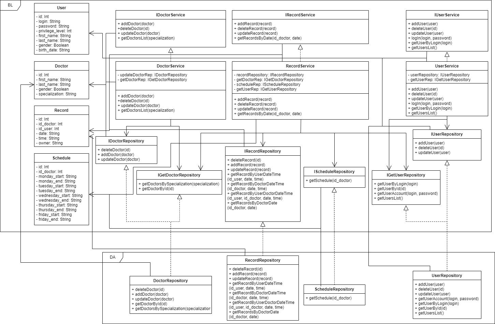

# Web-разработка

## Лабораторная работа №1
1. Цель работы. \
Данное приложение позволит автоматизировать запись пациентов к врачам.
2. Краткий перечень функциональных требований.\
Незарегитсрированный пользователь сможет посмотреть список врачей и войти в систему/зарегистрироваться.\Пациент также сможет записаться к врачу и редактировать свои записи и свой аккаунт. \
Администратор сможет редактировать все записи, аккаунты и всех врачей в системе.
3. Use-case диаграмма системы:\

4. BPMN диаграммы основных бизнес-процессов.\
BPMN диаграммы для адимнимстратора.\
Работа с записью на приём:\
\
Работа со списком врачей:\
\
Работа с данными аккаунтов:\
\
BPMN диаграммы для пользователя.\
Работа со своей записью на приём:\
\
Изменение данных своего аккаунта:\

7. ER-диаграмма сущностей:\

8. Пользовательские сценарии.\
Незарегистрированный пользователь может войти в систему, зарегистрироваться и посмотреть список врачей.\
Администратор может посмотреть список врачей, изменить данные своего аккаунта и добавить, удалить или изменить врача, пользователя или запись на приём.\
Пользователь может посмотреть список врачей, изменить данные своего аккаунта и добавить, удалить или изменить запись на приём.

## Лабораторная работа №2
1. Описание типа приложения и выбранного технологического стека:
- тип приложения - Telegram-бот;
- язык программирования - Java;
- СУБД - PostgreSQL.
2. Верхнеуровневое разбиение на компоненты:
- компонент доступа к данным;
- компонент бизнес-логики;
- компонент пользовательского интерфейса.
  

3. UML диаграммы классов для компонентов бизнес-логики и доступа к данным:
  

## Лабораторная работа №6
1. Уточнённая UML-диаграмма компонентов приложения.
  

2. Полная UML-диаграмма классов приложения.
  
