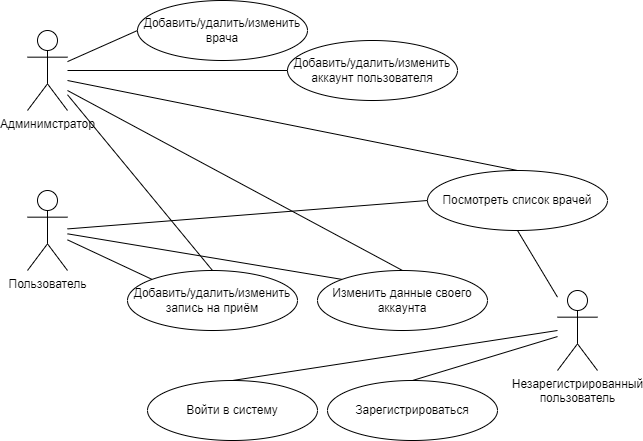

# Web-разработка

## Лабораторная работа №1
1. Название проекта.\
MedBot.
2. Краткое описание идеи проекта.\
Данное приложение позволит пациентам записываться на приём к врачам. Пациент сможет просмотреть список врачей и свободные места к ним, после чего выбрать любую удобную ему запись.
3. Краткое описание предметной области.\
Предметной областью проекта является государственное и частное здравоохранение. Приложение решает проблему необходимости очно приходить в медицинское учреждение для записи к врачу, а также проблему очередей.
4. Краткий анализ аналогичных решений:\

5. Краткое обоснование целесообразности и актуальности проекта.\
Разрабатываемое приложение отличается от рассмотренных аналогов в первую очередь типом платформы. Телеграм-бот не требует установки дополнительного программного обеспечения или его поиска в браузере. Достаточно просто начать чат с ботом в телеграме, что является преимуществом перед рассмотренными аналогами.
6. Use-case диаграмма:\

7. ER-диаграмма сущностей:\

8. Пользовательские сценарии.\
Незарегистрированный пользователь может войти в систему, зарегистрироваться и посмотреть список врачей.\
Администратор может посмотреть список врачей, изменить данные своего аккаунта и добавить, удалить или изменить врача, пользователя или запись на приём.\
Пользователь может посмотреть список врачей, изменить данные своего аккаунта и добавить, удалить или изменить запись на приём.
9. Формализация бизнес-правил.\
BPMN диаграммы для адимнимстратора.\
Работа с записью на приём:\
\
Работа со списком врачей:\
\
Работа с данными аккаунтов:\
\
BPMN диаграммы для пользователя.\
Работа со своей записью на приём:\
\
Изменение данных своего аккаунта:\

## Лабораторная работа №2
1. Описание типа приложения и выбранного технологического стека:
- тип приложения - Telegram-бот;
- язык программирования - Java;
- СУБД - PostgreSQL.
2. Верхнеуровневое разбиение на компоненты:
- компонент доступа к данным;
- компонент бизнес-логики;
- компонент пользовательского интерфейса.
  

3. UML диаграммы классов для компонентов бизнес-логики и доступа к данным:
  

## Лабораторная работа №6
1. Уточнённая UML-диаграмма компонентов приложения.
  

2. Полная UML-диаграмма классов приложения.
  
